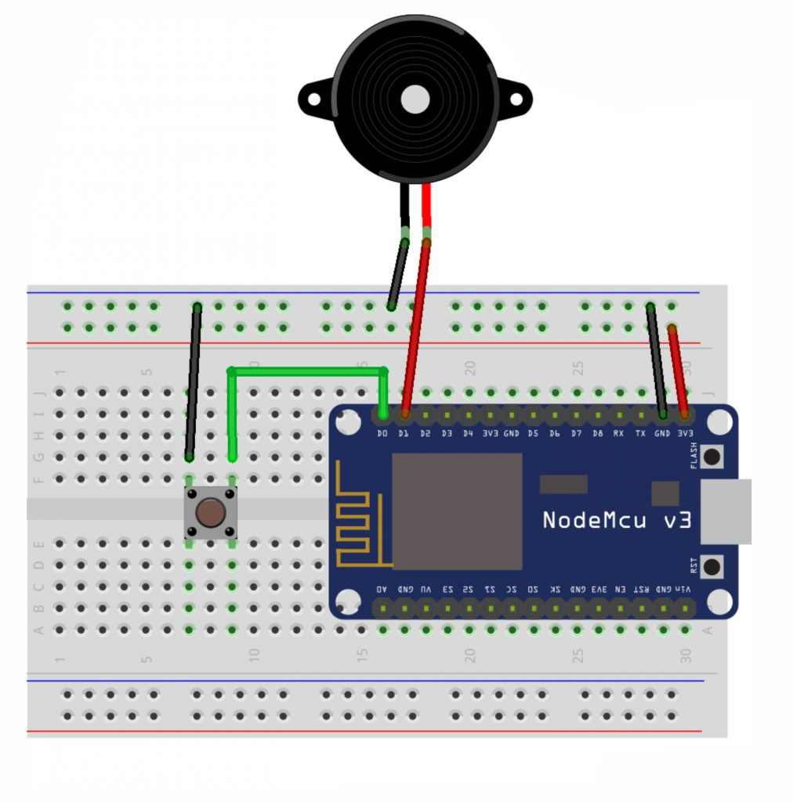
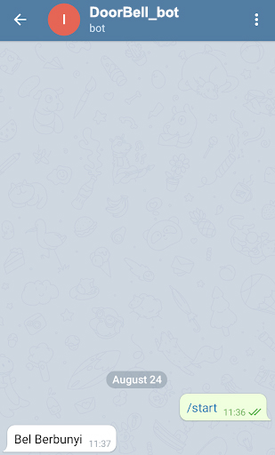

# IoT Project Telegram DoorBell

## Description

- An electric buzzer is an electronic component that can convert electrical signals into sound vibrations. In general, the buzzer, which is an audio device, is often used in anti-theft circuits, alarms on watches, house bells, reverse warnings on trucks and other danger warning devices.

## Circuit Schematic:

- Below you can see a schematic image to facilitate the wiring of cables from the microcontroller to devices, both input and output sensors:



## Component (Tools & Materials):

- NodeMCU ESP8266 = 1 unit;
- BreadBoard / Project Board = 1 unit;
- Piezo Buzzer = 1 unit;
- Push-Button = 1 unit.

## Sketch Code Program

```cpp
/* Program Telegram DoorBell */

#include "CTBot.h"
CTBot myBot;

String ssid = "Veendy-Suseno";    //nama ssid wifi kalian
String pass = "Admin12345";  //password wifi kalian
String token = "XXXX";      //token bot baru kalian
const int id = XXXX;        //id telegram kalian

int buzzer = D1;
int tomb = D0;

void setup() {
  Serial.begin(9600);
  Serial.println("Starting TelegramBot...");
  myBot.wifiConnect(ssid, pass);
  myBot.setTelegramToken(token);
  if (myBot.testConnection()) {
    Serial.println("Koneksi Bagus");
  } else {
    Serial.println("Koneksi Jelek");
  }
  pinMode(buzzer, OUTPUT);
  pinMode(tomb, INPUT_PULLUP);
}

void loop() {
  int push = digitalRead(tomb);
  if (push == LOW)  {
    tone(buzzer, 1000, 200);
    myBot.sendMessage(id, "Bel Berbunyi");
  }
  else {
    noTone(buzzer);
  }
  delay(100);
}

```

## Interface:
<br/>
- Interface Image to Telegram DoorBell

## Conclusion
- In this project, if the button is pressed, the buzzer will sound and NodeMCU will convey a message to our telegram that the buzzer has sounded.